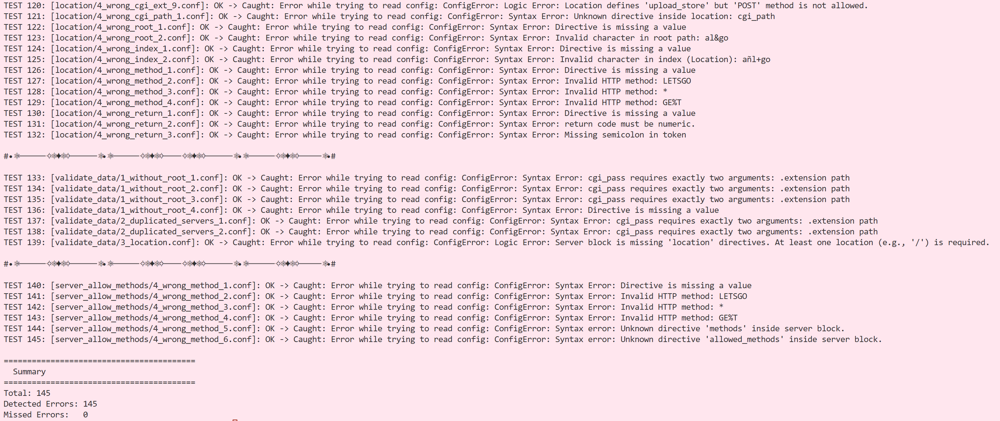

# Description
This script validates the robustness of the webserv configuration file parser (42Madrid school proyect) by testing its error handling capabilities. It uses a suite of malformed configuration files to verify that the parser correctly identifies invalid syntax and triggers the expected exceptions or status codes.

## Usage
1. Copy this repository into your main webserv project directory (where the webserv executable is generated).

2. Compile your webserv project:
```bash
make
```

3. Grant execution permissions to the test script:
```bash
chmod +x parse_test.sh
```

4. Execute the script and monitor the output in your terminal:
```bash
./parse_test.sh
```

## Output
The script will display the results of each test case, indicating whether the parser successfully caught the expected errors or failed to identify the malformed configuration.



## Author

* [KarmaFaber](https://github.com/KarmaFaber). 

## License
This is free and unencumbered software released into the public domain.

Anyone is free to copy, modify, publish, use, compile, sell, or distribute this software, either in source code form or as a compiled binary, for any purpose, commercial or non-commercial, and by any means.

In jurisdictions that recognize copyright laws, the author or authors of this software dedicate any and all copyright interest in the software to the public domain. We make this dedication for the benefit of the public at large and to the detriment of our heirs and successors. We intend this dedication to be an overt act of relinquishment in perpetuity of all present and future rights to this software under copyright law.

THE SOFTWARE IS PROVIDED "AS IS", WITHOUT WARRANTY OF ANY KIND, EXPRESS OR IMPLIED, INCLUDING BUT NOT LIMITED TO THE WARRANTIES OF MERCHANTABILITY, FITNESS FOR A PARTICULAR PURPOSE AND NONINFRINGEMENT. IN NO EVENT SHALL THE AUTHORS BE LIABLE FOR ANY CLAIM, DAMAGES OR OTHER LIABILITY, WHETHER IN AN ACTION OF CONTRACT, TORT OR OTHERWISE, ARISING FROM, OUT OF OR IN CONNECTION WITH THE SOFTWARE OR THE USE OR OTHER DEALINGS IN THE SOFTWARE.